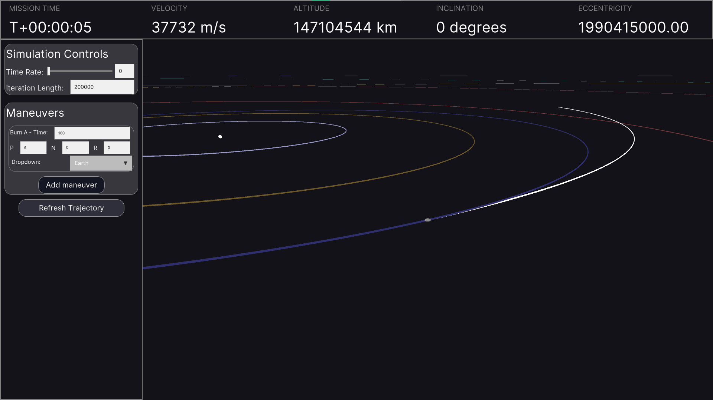
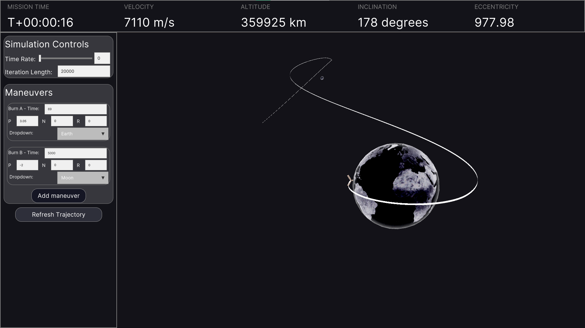

# Slingshot
## Orbital Dynamics Solver

Slingshot aims to provide a user-friendly astrodynamics UI to flight operations teams. NEW: Converted to Godot, awaiting full feature migration.





## Current Features

- Full solar system of planets with data taken from SPICE
- Multiple numerical integration models, including Runge-Kutta, Forest-Ruth, and Verlet
- Pseudo-adaptive step control allows high fidelity when close to bodies and low fidelity in deep space
- Basic simulation controls, including integration length and time rate
- Maneuver nodes that allow instantaneous changes in velocity
- Switching between references frames for both maneuvers and trajectory plotting
- A slick UI

## Planned Features

- More control over the propagation algorithms
- More minor solar system bodies, moons, rings, etc
- Maneuver node design tools
- Maneuver node visualization
- Rotating reference frames
- 2D plots to aid trajectory design
- Visual additions - Lagrange points, manifolds, gravitational potential plots, and more
- Attitude control simulation

## Setup Instructions

1. Clone the repo somewhere safe
2. Download the SPICE data required, place it at /AppData/Roaming/SPICE/ (currently only works on Windows)
3. Download the .NET library 8.0
4. Configure NuGet to use the local source stored in the repo at /editor/MyLocalNugetSource/
```
dotnet nuget add source <repo_location/editor/MyLocalNugetSource> --name MyLocalNugetSource
```
5. Clear the NuGet cache
```
dotnet nuget locals --clear all
```