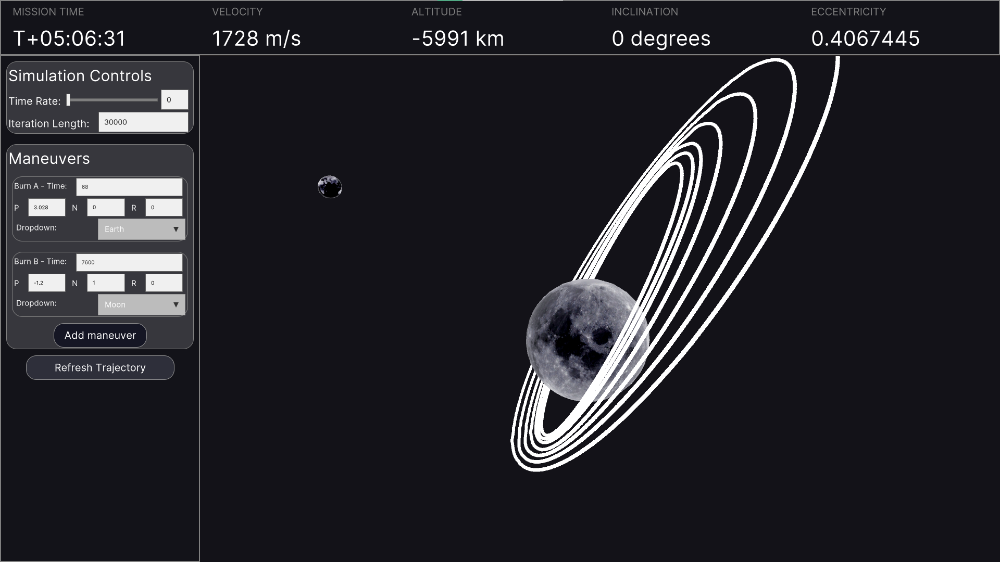
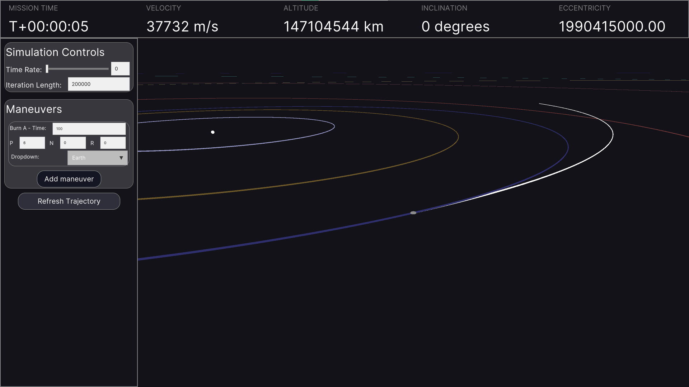
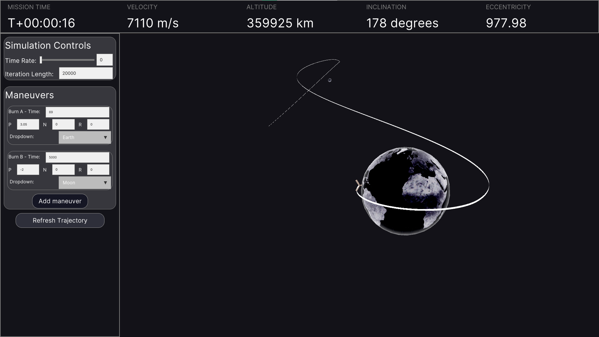

# Slingshot
## Orbital Dynamics Solver

Slingshot aims to provide a user-friendly astrodynamics experience to those looking to design spacecraft trajectories. Currently in the early phase with basic features.

## Current Features

- Full solar system of planets "on rails" - planets move in elliptical inclined orbits
- Multiple numerical integration models, including Runge-Kutta and Forest-Ruth symplectic models
- Pseudo-adaptive step control allows high fidelity when close to bodies and low fidelity in deep space
- Basic simulation controls, including integration length and time rate
- Maneuver nodes that allow instantaneous changes in velocity
- Switching between references frames for both maneuvers and trajectory plotting
- A slick UI

## Planned Features

- More control over the propagation algorithms
- More minor solar system bodies, moons, rings, etc
- Maneuver node design tools
- Maneuver node visualization
- Rotating reference frames
- 2D plots to aid trajectory design
- Visual additions - Lagrange points, manifolds, gravitational potential plots, and more
- Attitude control simulation
