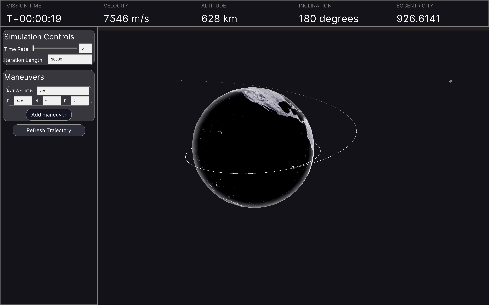

# Slingshot
## Orbital Dynamics Solver

Slingshot aims to provide a user-friendly astrodynamics experience to those looking to design spacecraft trajectories. Currently in the early phase with basic features.

## Current Features

- Framework for a full solar system of bodies "on rails" - planets move in circular orbits
- Adaptive-time Runge-Kutta4 trajectory propagation with _N_-body effects
- Basic simulation controls, including time interval and integration length
- Maneuver nodes that allow instantaneous changes in velocity
- Switching between references frames for both maneuvers and trajectory plotting
- A slick UI

## Planned Features

- Performance improvements
- More minor solar system bodies
- Solar system body visuals
- Solar system physics improvements (add inclined elliptical orbits)
- Maneuver node design tools
- Maneuver node visualization